# CMIT 495 - Project 2: Cloud Computing

**Student:** Aron Michaels  
**Date:** March 25, 2026  
**Course:** CMIT 495 Current Trends and Projects in Computer Networks and Security

## Project Overview
I provisioned a **Windows Server 2022** virtual machine in AWS EC2, connected using Remote Desktop (RDP), launched an **Ubuntu 24.04 LTS** server, created and mounted an **Amazon Elastic File System (EFS)**, uploaded proof to an **Amazon S3** bucket, and terminated all resources.

This demonstrates **PaaS** cloud computing, secure remote access, shared storage, and best practices.

## Skills Demonstrated
- AWS EC2 Windows + Linux provisioning
- RDP with decrypted password
- SSH via PuTTY
- EFS creation & NFSv4.1 mounting
- Security group configuration (RDP, SSH, NFS)
- S3 object upload
- Resource cleanup

## Files
- [Project2-Cloud-Computing-Aron.pdf](Project2-Cloud-Computing-Aron.pdf) ← Full assignment
- `/screenshots` folder with every step

## Key Learning Outcomes & Lessons Learned
- NIST cloud characteristics (on-demand self-service, rapid elasticity, measured service) in action.
- EFS is managed shared storage — I learned the hard way that **every** EFS mount target must use the exact same security group with NFS port 2049 allowed.
- Lesson: Always verify mount targets and security groups before running the mount command.

## Screenshots Gallery

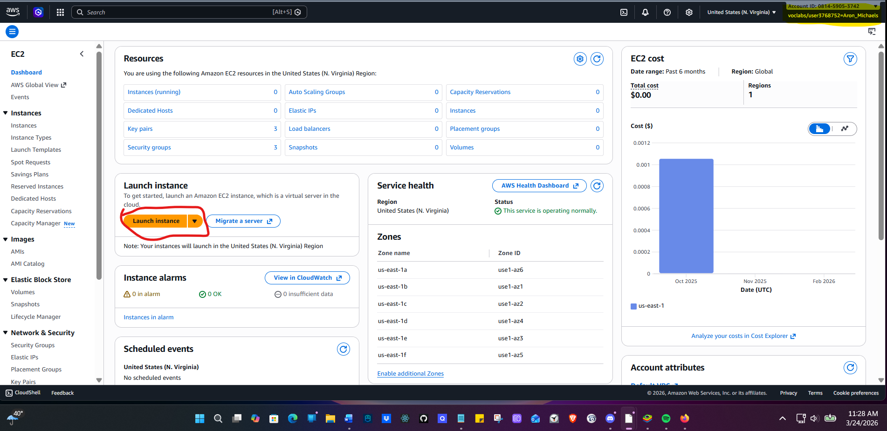  
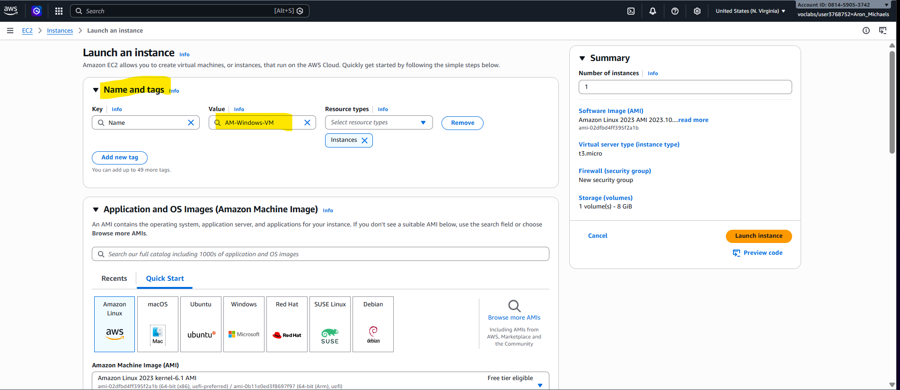  
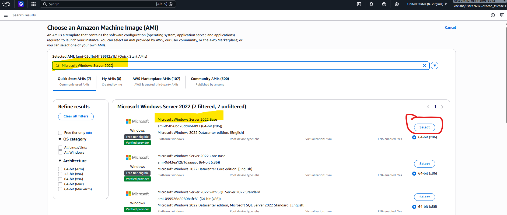  
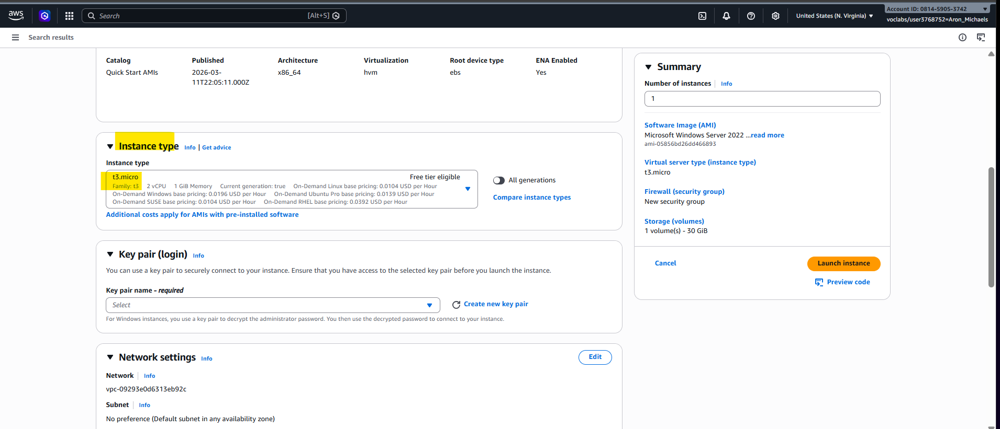  
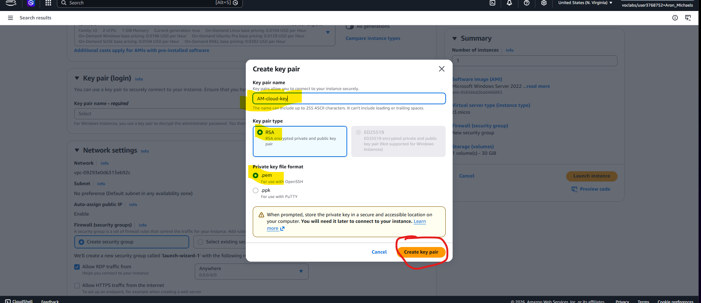  
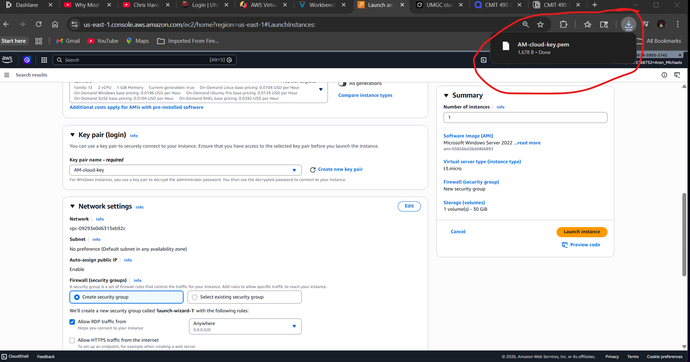  
  
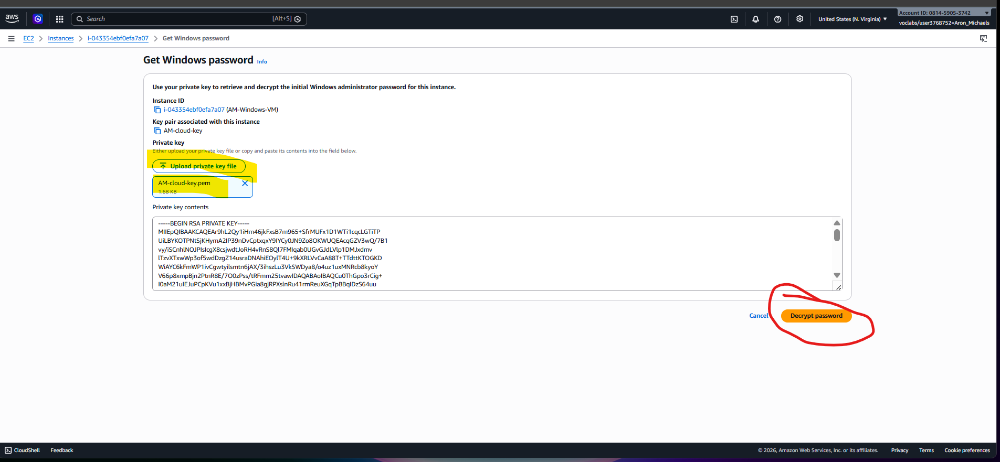  
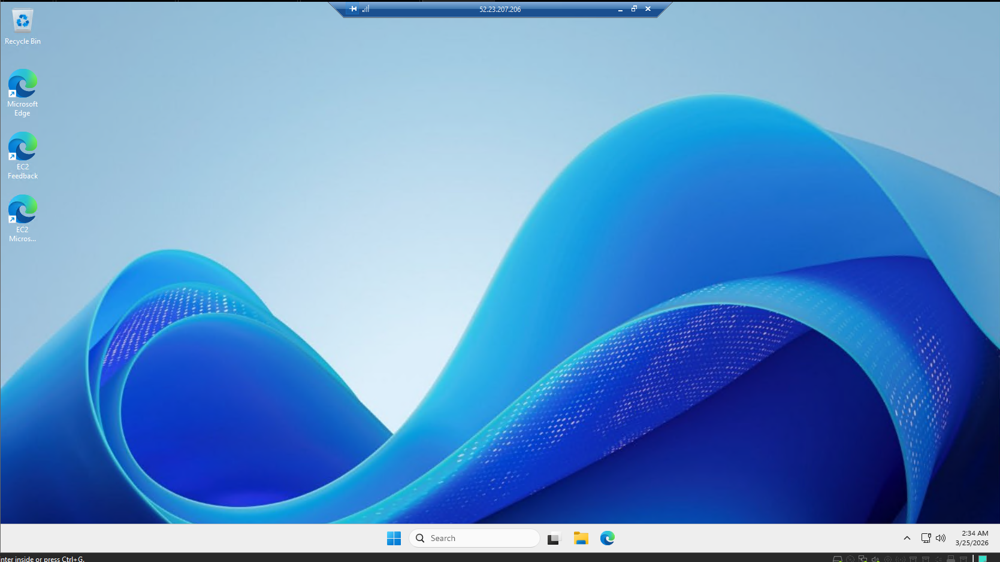  
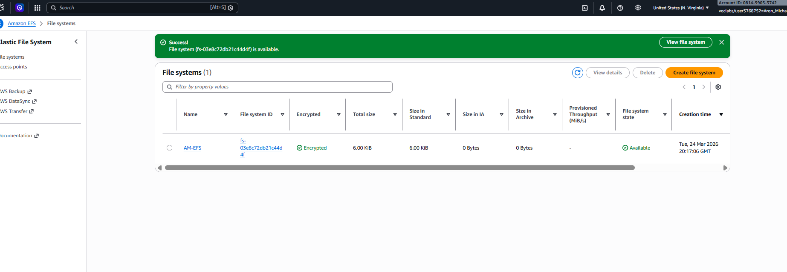  
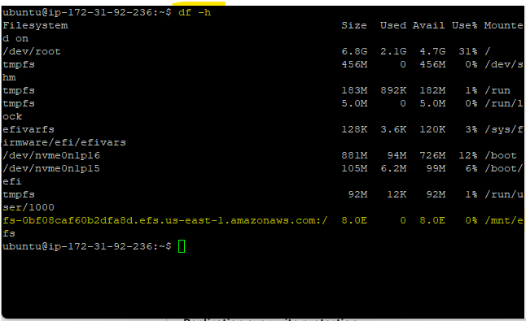  
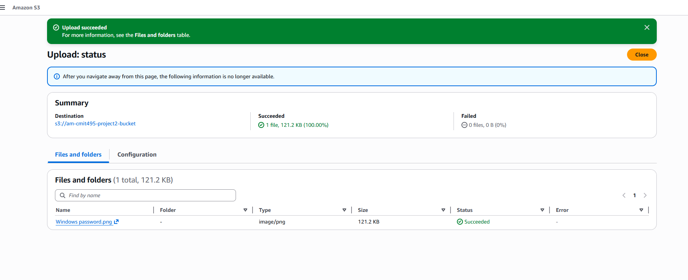

⭐ Completed as part of UMGC CMIT 495. Open to feedback!
